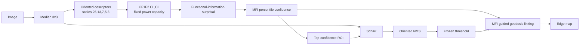
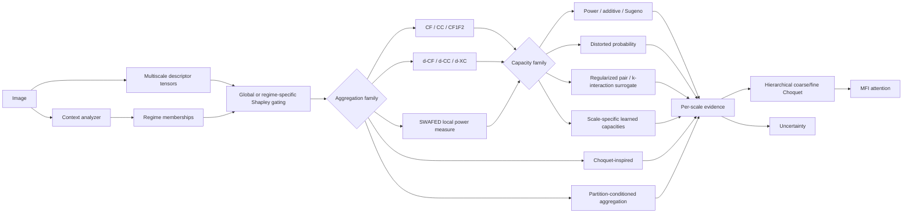
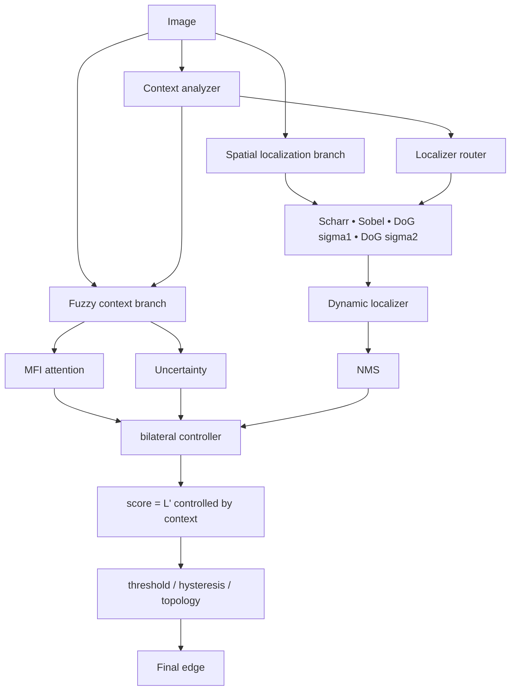
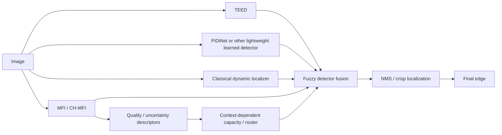
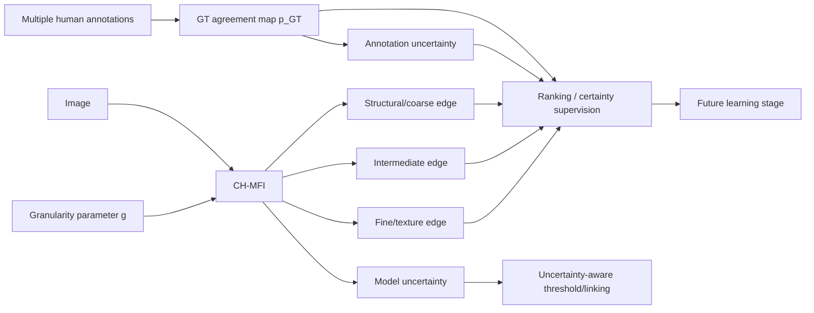
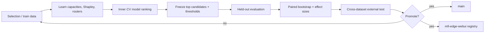

# MFI-Edge — architecture map for the future paper

This file is the **editable source of truth** for the model diagrams.  Keep it synchronized whenever a model family is added, renamed, or promoted.  The diagrams are Mermaid so they can be rendered directly by GitHub and later redrawn for the manuscript.

## 1. Global research architecture

```mermaid
flowchart LR
    I[Input image] --> C0[Robust conditioning]
    C0 --> CX[Context analyzer]
    C0 --> FE[Oriented multiscale descriptors]
    C0 --> SL[Spatial localizer branch]

    CX --> CTX[Context maps\nblur • noise • texture • HF/LF • coherence • heterogeneity]
    FE --> SG[Optional Shapley / regime gating]
    SG --> FA[Within-scale fuzzy aggregation]
    CTX --> SG
    CTX --> FA

    FA --> MS[Scale maps\n25 • 13 • 7 • 5 • 3]
    MS --> HM[Hierarchical multiscale fusion\ncoarse 25/13 + fine 7/5/3]
    HM --> MFI[MFI attention / evidence]
    MS --> U[Scale disagreement + entropy]
    U --> UNC[Uncertainty map]

    CTX --> SL
    SL --> DB[Dynamic derivative bank\nScharr • Sobel • DoG1 • DoG2]
    DB --> LOC[Precise spatial localization + NMS]

    MFI --> CTRL[Contextual / bilateral controller]
    UNC --> CTRL
    LOC --> CTRL
    CTRL --> SCORE[Continuous edge score]
    SCORE --> TH[Selection-frozen threshold / hysteresis]
    MFI --> LINK[MFI-guided topology repair]
    TH --> LINK
    LINK --> E[Final edge map]

    E --> EV[ODS/OIS/AP/F1 + connectivity + runtime]
```

The central hypothesis is that **MFI is primarily contextual evidence**, while the spatial branch is responsible for precise localization.  The controller decides how much the contextual evidence should influence the localizer rather than simply summing both maps.

---

## 2. Model A — MFI-Classic / historical control

Purpose in the article: historical baseline and ablation anchor.

---

## 3. Model B — MFI-Fuzzy++

Research question: **what to aggregate, how to aggregate, and which capacity should be used in each local regime and scale?**

---

## 4. Model C — CH-MFI / bilateral contextual-localization model

This is the current **CH-MFI-v2** research direction.  It operationalizes the observation from natural-image experiments that MFI may rank relevant regions well without being the best pixel localizer itself.

---

## 5. Model D — MFI-Hybrid / fuzzy ensemble of heterogeneous detectors

Purpose: test whether fuzzy nonadditive fusion is more valuable **between heterogeneous detectors** than only between handcrafted descriptor channels.

---

## 6. Model E — uncertainty + granularity-aware CH-MFI

This family requires datasets with multiple annotations (e.g. BSDS500 / Multicue) and should not be judged only on UDED.

---

## 7. Experimental decision flow

### Rules to preserve

- Never re-rank the full model family using held-out/test results.
- Capacity, Shapley, H0, context routers and thresholds must be learned/fitted without held-out leakage.
- UDED is useful for external generalization but is too small to be the sole dataset for final claims.
- Official publication metrics should ultimately use the official dataset evaluation protocol (especially BSDS500 boundary matching).
